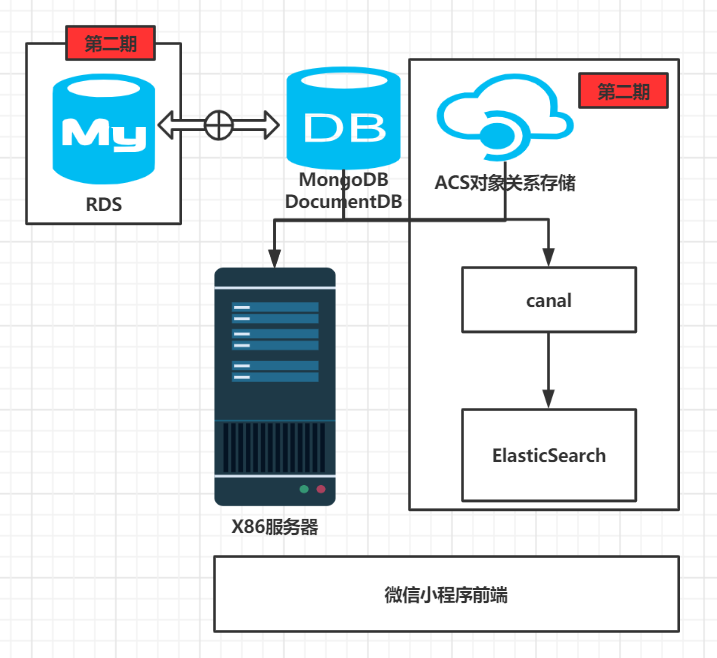

# ZRFintech
投融小管家项目组详细设计文档
### 系统架构

### 主要对象实体

### 功能点列表
#### 用户登陆
#### 投资人信息展示（企业视角）
#### 项目展示（投资人视角）
#### 项目上传（表单）
#### 项目上传（文件）
#### bp下载 
#### 红包模块
#### 评论模块


### 系统架构
    系统架构如下图所示，为了保证前期MVP开发，后端所有云资源均采取最简化配置（单机），由于数据关系相对简单
    且不存在较多关联查询，为快速部署和易于拓展，项目初期采用非关系型数据库。前期由于不存在搜索功能，所以canal和ES的
    资源也暂时不部署。对于图片、BP书由于前期数量不大，暂且均存在后端服务器上，后续搬上ACS对象存储服务器。
    后续业务流程复杂以后，考虑引入RDS如Mysql。


### 主要对象实体
#### 投资人基础信息

初始化导入

|字段名称|字段释译|字段类型|备注|
|:----:|:----:|:---:|:---:|
|investorId|投资人Id|String|拟采用自增id|
|orgNm|机构名称|String||
|pthoneNm|手机号码|String|白名单初始化|
|investor|投资人姓名|String||
|introd|投资人介绍|String||
|invesEmail|投资人邮箱|String||
|indusLab1|行业标签1|String||
|indusLab2|行业标签2|String||
|indusLab3|行业标签3|String||
|indusLab4|行业标签4|String||
|indusLab5|行业标签5|String||
|indusLab6|行业标签6|String||

#### 用户基础信息
|字段名称|字段释译|字段类型|备注|
|:----:|:----:|:---:|:---:|
|openId|用户唯一识别号|String||
|phoneNm|手机号|String||
|nickName|微信名称|String||
|gender|性别|char||
|city|城市|String||
|province|省|String||
|country|国|String||
|projects|项目集合|Object| key:projectNo(项目编号)、projectNm(项目名称) |

#### 项目基础信息
|字段名称|字段释译|字段类型|备注|
|:----:|:----:|:---:|:---:|
|projectNo|项目编号|String|项目唯一识别编号|
|projectNm|项目名称|String||
|openId|上传用户|String||
|proIndus|项目行业|String||
|proDes|项目描述|String||
|proVal|项目价值|String||
|bizModel|商业模式|String||
|cptEdge|竞争优势|String||
|operYear|经营年限|int||
|finSt|财务状况|String||
|teamSize|团队人数|int||
|ftrPlan|企业未来规划|String||
|bpRoute|BP路径|String||
|expList|期望点评列表|Arrays|investorId列表合集|


#### 项目评论信息
|字段名称|字段释译|字段类型|备注|
|:----:|:----:|:---:|:---:|
|id|评论主键|int||
|investorId|投资人Id|String||
|investor|投资人姓名|String||
|projectNo|项目编号|String||
|projectNm|项目名称|String||
|openId|上传用户|String||
|content|评论内容|String||
|updateTm|评论时间|timestamp|最新评论时间|
|stars|评论星级|int||
|reply|用户回评|String||
|replyTm|回复时间|timestamp||


### 功能点列表
|功能点|负责人|排期|
|:----:|:----:|:---:|
|用户登陆| |1|
|投资人信息分页展示（企业视角）| |1|
|项目展示（投资人视角）| |1|
|项目上传（表单）| |1|
|项目上传（文件）| |1|
|bp下载| |1|
|投资人领取红包| |1|
|投资人项目评论| |1|
|查看投资人评论| |1|
|反馈投资人评论| |1|
|投资人注册| |2|
|给投资人发送邮件| |2|


#### 用户登陆
- 功能描述

    用户在登陆时需要获取到微信本身开放的部分用户信息以及用户的手机号，在用户登陆到平台时，将相应信息发送到
    后端。
   
- 请求url

    1. mock链接:
    
    2. dev链接:

- 请求数据
```json
{
	"data":{
		"country":"",
		"projects":{
			"project1":{
				"projectNm":"",
				"projectNo":""
			}
		},
		"gender":"",
		"province":"",
		"city":"",
		"openId":"",
		"nickName":"",
		"phoneNm":""
	}
}
```

- 返回数据
    
    无

#### 投资人信息展示（企业视角）
- 功能描述
    
    用户点击查看投资人页面后，对于投资人信息进行分页展示，每当手机下滑到底部对后端进行请求。


- 请求url

    1. mock链接:
    
    2. dev链接:

- 请求数据
```json
{
	"pageNum":"",
    "pageSize":""
}
```

- 返回数据
```json
{
	"data":[
		{
			"indusLab1":"",
			"orgNm":"",
			"investor":"",
			"indusLab2":"",
			"investorId":"",
			"introd":"",
			"invesEmail":""
		}
	],
	"pageSize":"",
	"pageNum":""
}
```


#### 项目展示（投资人视角）
- 功能描述

    投资人点击入口后，对于投资人信息进行分页展示，每当手机下滑到底部对后端进行请求。
    
- 请求url

    1. mock链接:
    
    2. dev链接:

- 请求数据
```json
{
	"pageNum":"",
    "pageSize":""
}
```

- 返回数据
```json
{
	"data":[
		{
			"projectNo":"",
			"projectNm":"",
			"proIndus":"",
			"proDes":"",
			"operYear":"",
			"finSt":"",
			"bpRoute":""
		}
	],
	"pageSize":"",
	"pageNum":""
}
```

#### 项目上传（表单）
- 功能描述

    用户点击上传项目，分为模板表单上传和bp文件上传，此处为表单上传功能。后端获取到数据后
    和（自动生成的项目编号）一起更新用户基础信息projects字段以及项目基础信息部分。
    
- 请求url

    1. mock链接:
    
    2. dev链接:

- 请求数据
```json
{
	"data":
		{
			"finSt":"",
			"openId":"",
			"proVal":"",
			"operYear":"",
			"cptEdge":"",
			"projectNm":"",
			"expList":[],
			"projectNo":"",
			"teamSize":"",
			"bizModel":"",
			"ftrPlan":"",
			"proIndus":"",
			"proDes":""
		}
}
```

- 返回数据
```json
{
    "state": "",
    "message": ""
}
```

#### 项目上传（文件）
- 功能描述及逻辑

    用户点击上传项目，分为模板表单上传和bp文件上传，此处为文件上传功能。
    后端接收到文件后，统一保存到./data/bp/{openId}/{projectNo}/ 路径下，并更新数据库对应bpRoute字段。
    
- 请求url

    1. mock链接:
    
    2. dev链接:
    
- 请求数据
```json
{
  "openId": "",
  "projectNo": "",
  "data": "file"
}
```


- 返回数据
```json
{
    "state": "",
    "message": ""
}
```
    
    
#### bp下载 

#### 红包模块
- 功能描述及逻辑
    用户筛选投资人（勾选），点击（onclick）一键对接付款后，后端需要根据前端data中列表数据更新项目础信息中的
    expList字段以及项目评论信息表。
    
    **注意**：第一期当用户付款后暂不开发定时任务通知FA模块，由后端同事查看数据库后，手动将联系信息提交给运营同事联系运营。

- 请求url

    1. mock链接:
    
    2. dev链接:
    
- 请求数据
```json
{
	"data":[
		{
			"projectNm":"",
			"investor":"",
			"projectNo":"",
			"openId":"",
			"investorId":""
		}
	]
}
```


- 返回数据
```json
{
    "state": "",
    "message": ""
}
```

#### 评论模块
- 功能描述及逻辑
    
    评论模块涉及到投资人对于用户的项目进行评价，以及用户对于投资人评价的回评。故该模块功能点
    细化为以下几个部分。但所有模块均只涉及对于项目评价信息单表的修改。
    
1. 投资人待评价获取

2. 投资人评价/修改提交

3. 用户获取投资人评价

4. 用户对于投资人评价回评
   


基础组件：项目编号生成器开发（略）